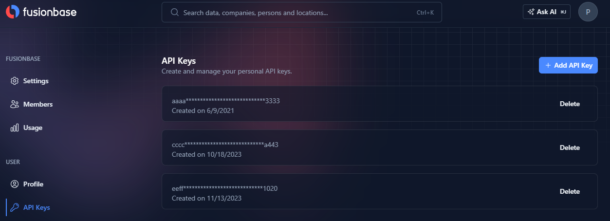

# Authentication

API requests are authenticated using API keys which are sent via the custom `X-API-KEY` header. Any request that doesn't include an API key will return an authentication error.

You can view and manage your API keys at the [profile settings](https://fusionbase.com/en/account/user/api-keys) page in your Fusionbase account.

All API requests must be made over HTTPS. Calls made over plain HTTP will be redirected to HTTPS. API requests without authentication will fail.


Your API keys carry many privileges, so be sure to keep them secure! **Do not share** your secret API keys in **publicly** accessible areas such as GitHub, client-side code, and so forth.


## Creating API Keys <a href="#api-key-generation" id="api-key-generation"></a>

Go to your[ account profile ](https://fusionbase.com/en/account/user/api-keys)and press the _**Add API Key**_ button.

<figure><figcaption></figcaption></figure>


Do never disclose your API key publicly.


## Authenticate Requests <a href="#authenticate-requests" id="authenticate-requests"></a>

The API key is added via the `x-api-key` property in the request header.



```bash
curl -X GET "https://api.fusionbase.com/api/v2/stream/base/430410" \
-H 'X-API-KEY: 'YOUR_API_KEY \
-H 'Content-Type: application/json; charset=utf-8' \

```



```python
import requests

url = "https://api.fusionbase.com/api/v2/stream/base/430410"
headers = {
    'X-API-KEY': 'YOUR_API_KEY',
    'Content-Type': 'application/json; charset=utf-8',
}

response = requests.get(url, headers=headers)
print(response.json())

```



```java
import java.io.BufferedReader;
import java.io.InputStreamReader;
import java.net.HttpURLConnection;
import java.net.URL;

public class Main {
    public static void main(String[] args) throws Exception {
        URL url = new URL("https://api.fusionbase.com/api/v2/stream/base/430410");
        HttpURLConnection con = (HttpURLConnection) url.openConnection();
        con.setRequestMethod("GET");
        con.setRequestProperty("X-API-KEY", "YOUR_API_KEY");
        con.setRequestProperty("Content-Type", "application/json; charset=utf-8");

        BufferedReader in = new BufferedReader(new InputStreamReader(con.getInputStream()));
        String inputLine;
        StringBuffer content = new StringBuffer();
        while ((inputLine = in.readLine()) != null) {
            content.append(inputLine);
        }
        in.close();
        con.disconnect();
        
        System.out.println(content.toString());
    }
}
```



```go
package main

import (
    "fmt"
    "net/http"
    "io/ioutil"
)

func main() {
    url := "https://api.fusionbase.com/api/v2/stream/base/430410"
    req, _ := http.NewRequest("GET", url, nil)

    req.Header.Add("X-API-KEY", "YOUR_API_KEY")
    req.Header.Add("Content-Type", "application/json; charset=utf-8")

    res, _ := http.DefaultClient.Do(req)
    defer res.Body.Close()
    body, _ := ioutil.ReadAll(res.Body)

    fmt.Println(string(body))
}
```



```javascript
const axios = require('axios');

axios.get('https://api.fusionbase.com/api/v2/stream/base/430410', {
    headers: {
        'X-API-KEY': 'YOUR_API_KEY',
        'Content-Type': 'application/json; charset=utf-8'
    }
})
.then((response) => {
    console.log(response.data);
})
.catch((error) => {
    console.error(error);
});
```



```php
<?php

$curl = curl_init();

curl_setopt_array($curl, [
    CURLOPT_URL => "https://api.fusionbase.com/api/v2/stream/base/430410",
    CURLOPT_RETURNTRANSFER => true,
    CURLOPT_CUSTOMREQUEST => "GET",
    CURLOPT_HTTPHEADER => [
        "X-API-KEY: YOUR_API_KEY",
        "Content-Type: application/json; charset=utf-8"
    ],
]);

$response = curl_exec($curl);

curl_close($curl);
echo $response;
?>
```



