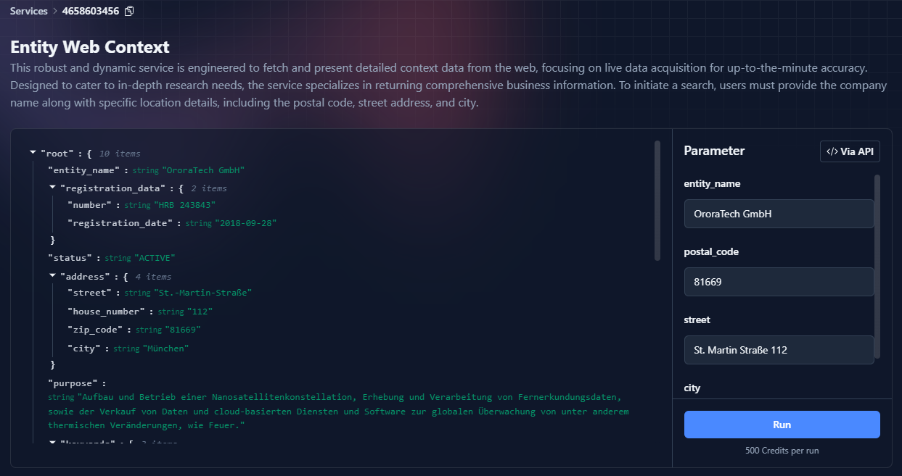

# Services

Our Data Service API functions as an interface that delivers specific outputs in response to defined inputs. It is designed to streamline the process of retrieving targeted data efficiently and accurately.

**Example:** [**Web Context Service for Organizations**](https://fusionbase.com/de/data/service/4658603456/Entity%20Web%20Context)

**Functionality:** The Web Context Service for Organizations is a specialized feature of our Data Service API. It is engineered to collect and return comprehensive, publicly available information about various companies.

**How It Works:**

* **Input:** You provide the name or identifier of a company.
* **Process:** The service searches through an extensive database of public records and digital resources.
* **Output:** It returns a detailed compilation of information about the specified company. This may include company size, location, industry, public financial records, and other relevant organizational data.

**Use Case:** This service is particularly useful for market researchers, financial analysts, and business development professionals who need quick and reliable access to company profiles and industry data.



All services work the exact same way - No need to learn and adapt to a lot of different API services and documentations.


There is only a single endpoint to access services through Fusionbase:\
[https://api.fusionbase.com/api/v2](https://api.fusionbase.com/api/v1/data-service/invoke)[/service/invoke](https://api.fusionbase.com/api/v2/service/invoke)



Takes the service specific input values and returns the result of the service.&#x20;



The service ID as specified on the service's API page.



JSON object containing the key (input parameter name) and value pairs to invoke the data service.







#### Example

All services are used in the exact same way. Let's take the [**Web Context Service for Organizations**](https://fusionbase.com/en/data/service/50527318/Company%20Internet%20Context) as an example on how to use them via the API.

<figure><figcaption><p>Entity Web Context - Data Service</p></figcaption></figure>

The Company Web Context Service is designed to retrieve and compile comprehensive internet-based information about specific companies.

**Key Features:**

* **Input Parameters:** The service requires four input values: `entity_name`, `postal_code`, `street` and `city`
* **Service ID:** This service is identified by the ID `4658603456`.

**Example Usage:** To invoke this service for "OroraTech GmbH" located in the zip code area "81669", a POST request can be made as follows:




```bash
curl -X "POST" "https://api.fusionbase.com/api/v2/service/invoke" \
-H 'X-API-KEY: YOUR_API_KEY' \
-H 'Content-Type: application/json; charset=utf-8' \
-d $'{
"inputs": {
    "company_name": "OroraTech GmbH",
    "postal_code": "81669",
    "street": "St. Martin Straße 112",
    "city": "München"
},
"service_key": "4658603456" # THE ID OF THE SERVICE
}'
```



```python
import requests
import json

url = "https://api.fusionbase.com/api/v2/service/invoke"
headers = {
    "X-API-KEY": "YOUR_API_KEY",
    "Content-Type": "application/json; charset=utf-8"
}
payload = {
    "inputs": {
       "company_name": "OroraTech GmbH",
       "postal_code": "81669",
       "street": "St. Martin Straße 112",
       "city": "München"
    },
    "service_key": "4658603456"
}

response = requests.post(url, headers=headers, data=json.dumps(payload))
print(response.text)

```



```javascript
const axios = require('axios');

const url = "https://api.fusionbase.com/api/v2/service/invoke";
const headers = {
    "X-API-KEY": "YOUR_API_KEY",
    "Content-Type": "application/json; charset=utf-8"
};
const payload = {
    inputs: {
       company_name: "OroraTech GmbH",
       postal_code: "81669",
       street: "St. Martin Straße 112",
       city: "München"
    },
    service_key: "4658603456"
};

axios.post(url, payload, { headers: headers })
    .then(response => console.log(response.data))
    .catch(error => console.error('Error:', error));

```



```java
import java.net.HttpURLConnection;
import java.net.URL;
import java.io.OutputStream;
import java.nio.charset.StandardCharsets;

public class Main {
    public static void main(String[] args) {
        try {
            URL url = new URL("https://api.fusionbase.com/api/v2/service/invoke");
            String jsonInputString = "{\"inputs\": {"
                + "\"company_name\": \"OroraTech GmbH\", "
                + "\"postal_code\": \"81669\", "
                + "\"street\": \"St. Martin Straße 112\", "
                + "\"city\": \"München\"}, "
                + "\"service_key\": \"4658603456\"}";
            byte[] postData = jsonInputString.getBytes(StandardCharsets.UTF_8);

            HttpURLConnection con = (HttpURLConnection) url.openConnection();
            con.setRequestMethod("POST");
            con.setRequestProperty("X-API-KEY", "YOUR_API_KEY");
            con.setRequestProperty("Content-Type", "application/json; charset=utf-8");
            con.setDoOutput(true);

            try(OutputStream os = con.getOutputStream()) {
                os.write(postData, 0, postData.length);
            }

            int responseCode = con.getResponseCode();
            System.out.println("POST Response Code : " + responseCode);
            // Handle response...

        } catch (Exception e) {
            e.printStackTrace();
        }
    }
}

```



```go
package main

import (
    "bytes"
    "encoding/json"
    "fmt"
    "net/http"
)

func main() {
    url := "https://api.fusionbase.com/api/v2/service/invoke"
    payload := map[string]interface{}{
        "inputs": map[string]string{
            "company_name": "OroraTech GmbH",
            "postal_code": "81669",
            "street": "St. Martin Straße 112",
            "city": "München"
        },
        "service_key": "4658603456",
    }
    jsonPayload, _ := json.Marshal(payload)

    client := &http.Client{}
    req, _ := http.NewRequest("POST", url, bytes.NewBuffer(jsonPayload))
    req.Header.Add("X-API-KEY", "YOUR_API_KEY")
    req.Header.Add("Content-Type", "application/json; charset=utf-8")

    resp, err := client.Do(req)
    if err != nil {
        fmt.Println("Error:", err)
        return
    }
    defer resp.Body.Close()
    
    // Read response
    fmt.Println("Response status:", resp.Status)
}


```


